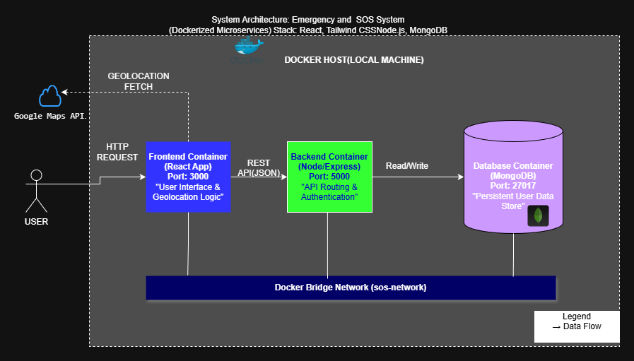
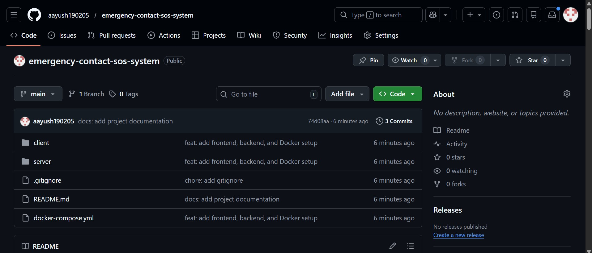
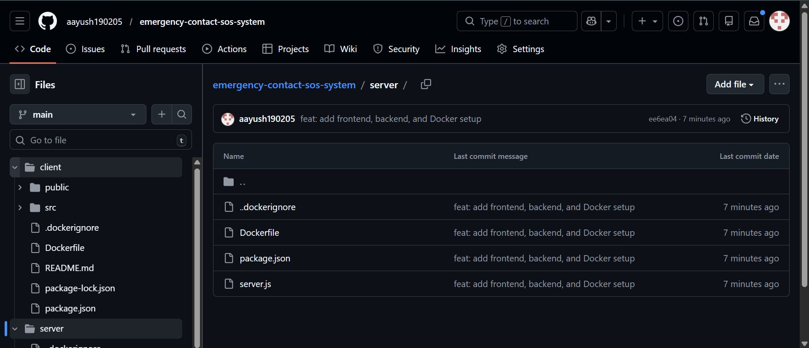
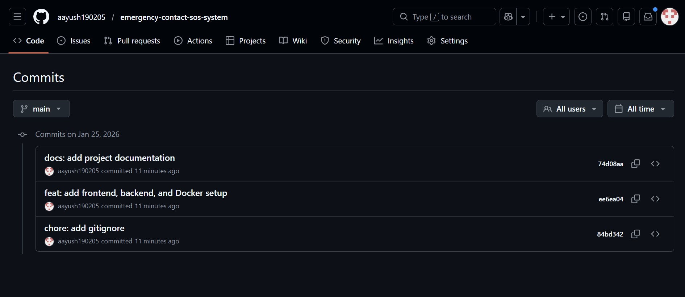
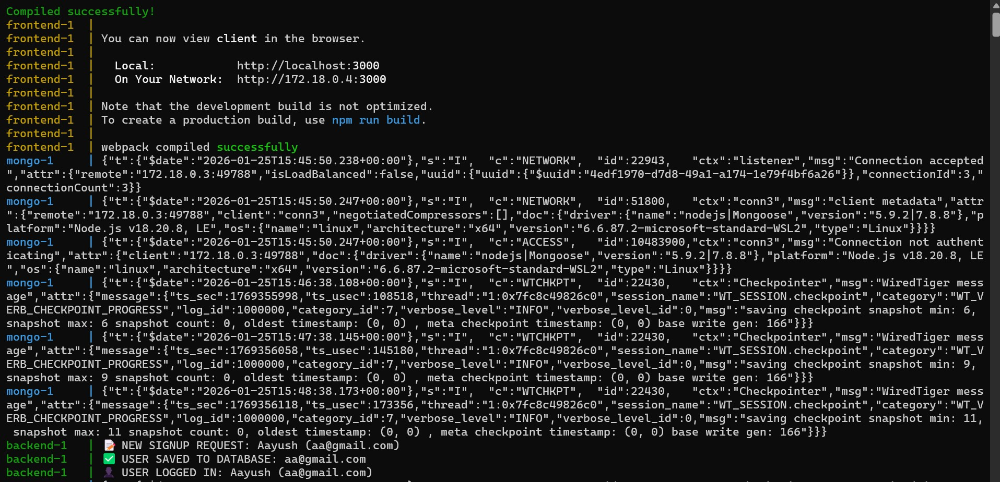
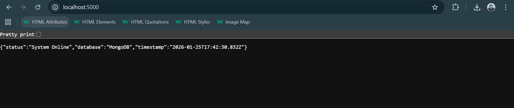
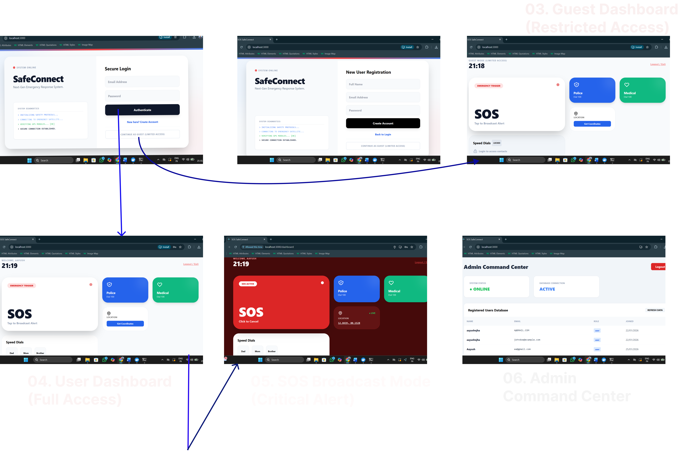

# Emergency Contact & SOS Awareness System

## Project Overview

The **Emergency Contact & SOS Awareness System** is a web-based emergency response and awareness application that provides **instant access to emergency services, SOS alerts, and location-based assistance** during critical situations.

The system is designed to work **without mandatory login**, ensuring accessibility during panic scenarios. It supports **guest users, registered users, and administrators**, and follows a **Dockerized microservices architecture** for consistency and scalability.

---

## Problem Statement

In emergency situations, users often:
- Panic and are unable to navigate complex applications
- Do not remember emergency contact numbers
- Lose time searching for help
- Face internet or usability limitations

This project addresses these challenges by offering a **centralized SOS dashboard**, **visual-first emergency actions**, and **minimal user interaction** to reduce response time and confusion.

---

## Target Users (Personas)

| User Group | Description |
|----------|-------------|
| General Users | Need immediate emergency assistance |
| Senior Citizens | Require simple and accessible UI |
| Students & Children | Need intuitive and visual emergency actions |
| Guest Users | Need emergency access without login |
| Administrators | Manage system users and monitor status |

---

## Vision Statement

To build a **fast, accessible, and reliable emergency awareness system** that enables users to take immediate action during emergencies, regardless of login status or technical ability.

---

## Key Features

### User Features
- SOS emergency trigger
- Police, medical, and fire service access
- Live location fetching
- Guest mode with restricted access
- Full dashboard for registered users
- Visual SOS broadcast mode

### Admin Features
- Secure admin login
- View registered users
- System and database status monitoring

---
## MoSCoW Prioritization

The following prioritization matrix outlines the feature scope for the SafeConnect system, ensuring critical emergency functionality is delivered first.

| Priority | Category | Features Included | Justification |
| :--- | :--- | :--- | :--- |
| **M** | **MUST HAVE**<br>*(Critical for MVP)* | • **SOS Trigger Button**<br>• **Live Geolocation (Lat/Long)**<br>• **User Authentication (Login/Signup)**<br>• **Guest Access Mode**<br>• **Database Persistence (MongoDB)**<br>• **Dockerized Setup** | These are the non-negotiable core requirements. The system is non-functional as an emergency tool without these features. |
| **S** | **SHOULD HAVE**<br>*(High Priority)* | • **Admin Dashboard**<br>• **Speed Dials (Police/Medical)**<br>• **System Diagnostics Animation**<br>• **Responsive Design** | Essential for a usable and complete product experience, though the core SOS signal could technically function without them. |
| **C** | **COULD HAVE**<br>*(Nice to Have)* | • **AI Safety Chatbot**<br>• **Dark/Light Mode Toggle**<br>• **First Aid Content Pages**<br>• **SMS/Email Integration** | Desirable features that enhance user experience but are not critical for the immediate emergency response loop. |
| **W** | **WON'T HAVE**<br>*(Out of Scope)* | • **Video Streaming**<br>• **Payment Gateways**<br>• **Social Media Sharing**<br>• **Voice Calls** | These features add unnecessary complexity and distraction from the primary goal of rapid emergency signaling. |

## User Stories

- **25 user stories** implemented using **GitHub Issues**
- All stories are user-focused and numbered for traceability

---

## System Architecture

**Technology Stack**
- Frontend: React
- Backend: Node.js + Express
- Database: MongoDB
- Containerization: Docker & Docker Compose
- Deployment: Local Docker Host (Review-1)

### Architecture Diagram


---

## Project Structure

```text
emergency-sos-system/
├── client/
│   ├── src/
│   ├── public/
│   ├── Dockerfile
│   ├── package.json
│   └── .dockerignore
│
├── server/
│   ├── server.js
│   ├── Dockerfile
│   ├── package.json
│   └── .dockerignore
│
├── docker-compose.yml
├── .gitignore
├── README.md
└── docs/
    └── screenshots/
```
Branching Strategy

This project follows GitHub Flow:

main branch for stable code

Feature branches for development

Branch Screenshot

Local Development Tools

Node.js

React

Express.js

MongoDB

Docker Desktop

GitHub

Figma

Draw.io

Quick Start – Local Development
Prerequisites

Docker Desktop installed and running

Run the Application
docker-compose up --build

Service URLs
Service	URL
Frontend	http://localhost:3000

Backend	http://localhost:5000

MongoDB	localhost:27017
Backend Health Check
GET http://localhost:5000/


Expected response:

{
  "status": "System Online",
  "database": "MongoDB / Memory",
  "timestamp": "..."
}

Screenshots & Proof of Work
## Screenshots & Proof of Work

### GitHub Repository



### GitHub Management




### Docker & Application




### Design Artifacts


Project Status (Review-1)
Completed

Vision document

MoSCoW prioritization

25 GitHub user stories

UI design (Figma)

Architecture design (Draw.io)

Frontend & backend implementation

MongoDB integration

Docker & Docker Compose setup

Upcoming

Feature enhancements

Security hardening

Cloud deployment

Final testing

Disclaimer

This system provides emergency awareness and guidance only and does not replace official emergency services.
