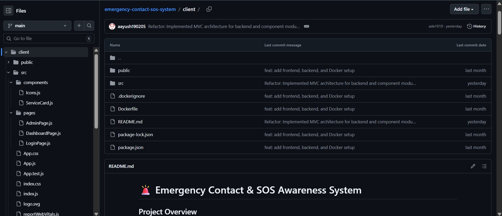
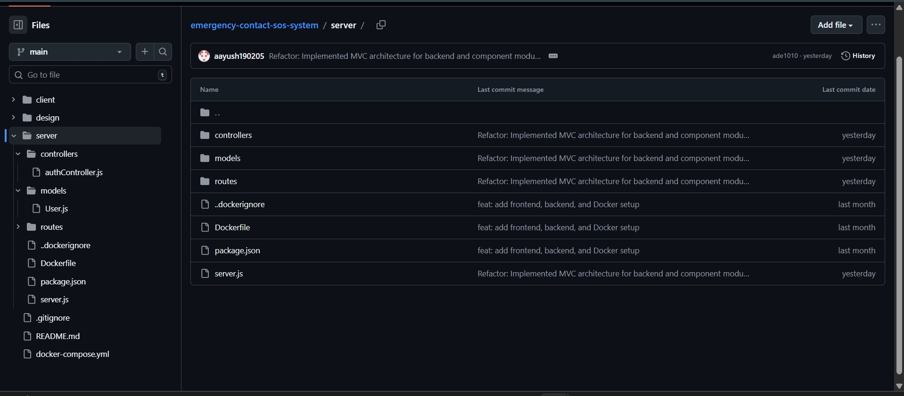
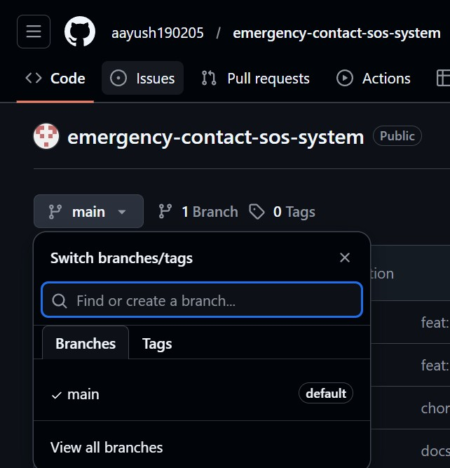
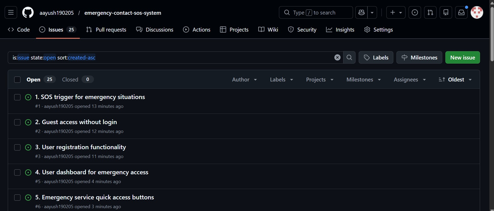
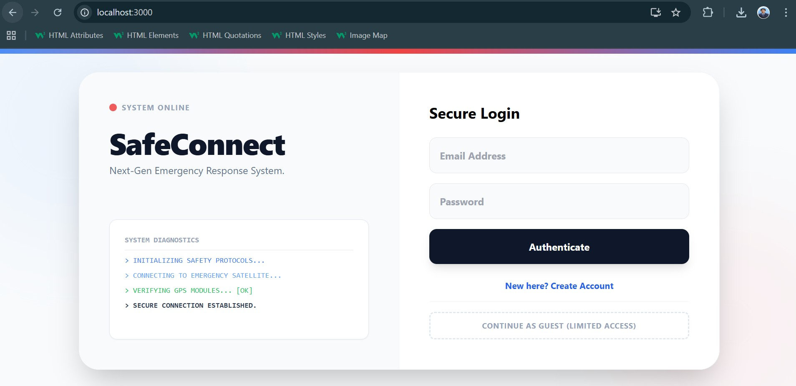

# SafeConnect: Emergency Contact & SOS Awareness System

## Project Overview

The **Emergency Contact & SOS Awareness System** is a web-based emergency response and awareness application that provides **instant access to emergency services, SOS alerts, and location-based assistance** during critical situations.

The system is designed to work **without mandatory login**, ensuring accessibility during panic scenarios. It supports **guest users, registered users, and administrators**, and follows a **Dockerized microservices architecture** for consistency and scalability.

---

## Problem Statement

In emergency situations, users often:
- Panic and are unable to navigate complex applications.
- Do not remember emergency contact numbers.
- Lose time searching for help.
- Face internet or usability limitations.

This project addresses these challenges by offering a **centralized SOS dashboard**, **visual-first emergency actions**, and **minimal user interaction** to reduce response time and confusion.

---

## Target Users (Personas)

| User Group | Description |
| :--- | :--- |
| **General Users** | Need immediate emergency assistance. |
| **Senior Citizens** | Require simple, high-contrast, and accessible UI. |
| **Students & Children** | Need intuitive and visual emergency actions. |
| **Guest Users** | Need emergency access instantly without a login barrier. |
| **Administrators** | Manage system users and monitor system health. |

---

## Vision Statement

To build a **fast, accessible, and reliable emergency awareness system** that enables users to take immediate action during emergencies, regardless of login status or technical ability.

---

## Key Features

### User Features
- One-tap SOS emergency trigger.
- Quick-dial access for Police, Medical, and Fire services.
- Live Geolocation fetching (Lat/Long).
- Frictionless Guest Mode with restricted speed-dial access.
- Visual SOS broadcast mode (Red Alert screen).

### Admin Features
- Secure admin login portal.
- View and refresh the registered users database.
- System and database status monitoring.

---

## MoSCoW Prioritization

| Priority | Category | Features Included | Justification |
| :--- | :--- | :--- | :--- |
| **M** | **MUST HAVE**<br>*(Critical for MVP)* | • SOS Trigger Button<br>• Live Geolocation (Lat/Long)<br>• User Authentication<br>• Guest Access Mode<br>• MongoDB Persistence<br>• Dockerized Setup | These are non-negotiable core requirements. The system is non-functional as an emergency tool without them. |
| **S** | **SHOULD HAVE**<br>*(High Priority)* | • Admin Dashboard<br>• Speed Dials (Police/Medical)<br>• System Diagnostics Animation<br>• Responsive Design | Essential for a usable and complete product experience. |
| **C** | **COULD HAVE**<br>*(Nice to Have)* | • AI Safety Chatbot<br>• Dark/Light Mode Toggle<br>• First Aid Content Pages | Desirable features that enhance UX but are not critical for the immediate SOS loop. |
| **W** | **WON'T HAVE**<br>*(Out of Scope)* | • Video Streaming<br>• Payment Gateways<br>• Voice Calls | Add unnecessary complexity and distraction from the primary goal of rapid emergency signaling. |

---

## Software Design & Architecture

SafeConnect is built on a **Client-Server Microservices** model, prioritizing high availability and separation of concerns.

### Design Principles Applied:
- **Abstraction:** Complex logic for geospatial tracking and Docker networking is hidden behind simple API interfaces, reducing frontend cognitive load.
- **Modularity:** The React frontend is normalized into independent `components/`, `pages/`, and `App.js` layers, while the backend follows a strict **MVC (Model-View-Controller)** pattern.
- **Low Coupling:** The frontend and backend communicate exclusively via RESTful JSON APIs, allowing either stack to be updated or replaced without affecting the other.


### Design Assets:
- **Architecture Diagram:** [View Source (Draw.io)](design/09-architecture-diagram.png)
- **Figma Prototype:** [Interactive Design Link](https://www.figma.com/design/VwCXnGxN0injGcRJxx3ByM/Untitled?node-id=0-1&t=ccThDtaSKTexUO9m-1)
- **Full Design Board:** [View Master Board](design/10-figma-screens.png)

####  UI Screen Gallery
| Screen | Link |
| :--- | :--- |
| **01. Login** | [View Interface](design/figma-screen-1.png) |
| **02. Registration** | [View Interface](design/figma-screen-2.png) |
| **03. Guest Dashboard** | [View Interface](design/figma-screen-3.png) |
| **04. User Dashboard** | [View Interface](design/figma-screen-4.png) |
| **05. Active SOS State** | [View Interface](design/figma-screen-5.png) |
| **06. Admin Center** | [View Interface](design/figma-screen-6.png) |

---

## User Stories

- **25 user stories** implemented using **GitHub Projects & Issues**.
- All stories are user-focused, numbered for traceability, and categorized by Epic.

---

## System Architecture & Tech Stack

**Technology Stack**
- **Frontend:** React.js, Tailwind CSS
- **Backend:** Node.js, Express.js
- **Database:** MongoDB
- **Containerization:** Docker & Docker Compose
- **Design & Flow:** Figma, Draw.io

### Project Structure

```text
EMERGENCY-SOS-SYSTEM/
├── client/                     # React Frontend (UI Layer)
│   ├── src/
│   │   ├── components/         # Reusable UI widgets (SOSButton, Map)
│   │   ├── pages/              # Modular screens (Dashboard, Login)
│   │   └── App.js              # Centralized routing & logic
│   ├── .env                    # Environment variables
│   └── Dockerfile              # Frontend containerization
│
├── server/                     # Node.js Backend (MVC Architecture)
│   ├── controllers/            # Business logic (SOS/Auth handling)
│   ├── models/                 # Database schemas (Mongoose/MongoDB)
│   ├── routes/                 # API endpoint definitions
│   ├── server.js               # Entry point & DB connection
│   └── Dockerfile              # Backend containerization
│
├── design/                     # Documentation & Visual Assets
│   ├── 01-github-repo-home.jpg
│   ├── 02-repo-structure.jpg
│   ├── 03-github-branches.jpg
│   ├── 04-github-commits.jpg
│   ├── 05-github-issues.jpg
│   ├── 06-docker-running.jpg
│   ├── 07-backend-running.jpg
│   ├── 08-frontend-ui.jpg
│   ├── 09-architecture-diagram.png
│   ├── 10-figma-screens.png
│   ├── figma-screen-1.png      # Secure Login Interface
│   ├── figma-screen-2.png      # New User Registration
│   ├── figma-screen-3.png      # Guest Mode Dashboard
│   ├── figma-screen-4.png      # Authenticated User Dashboard
│   ├── figma-screen-5.png      # High-Contrast Active SOS State
│   ├── figma-screen-6.png      # Admin Command Center
│   ├── architecture-source.drawio # Editable Source File
│   └── backend-repo-structure.jpg # Backend specific structure
│
└── docker-compose.yml          # Multi-container orchestration logic
```
### Branching Strategy

This project follows GitHub Flow:
* main branch for stable code
* Feature branches for development

[Branch Screenshot]

### Local Development Tools
* Node.js
* React
* Express.js
* MongoDB
* Docker Desktop
* GitHub
* Figma
* Draw.io

---

### Quick Start – Local Development

**Prerequisites**
Docker Desktop installed and running

**Run the Application**
```bash
docker-compose up --build
Service URLs

Frontend: http://localhost:3000

Backend: http://localhost:5000

MongoDB: localhost:27017

Backend Health Check
GET http://localhost:5000/

Expected response:

JSON
{
  "status": "System Online",
  "database": "MongoDB / Memory",
  "timestamp": "..."
}
```
##  Screenshots & Proof of Work
### GitHub Repository





### GitHub Management




### Docker & Application




---

## Project Status

###  Completed (Review-1 & 2)
* Vision document
* MoSCoW prioritization
* 25 GitHub user stories
* UI design (Figma)
* Architecture design (Draw.io)
* Partial Frontend & backend implementation
* MongoDB integration
* Docker & Docker Compose setup

###  Upcoming
* Feature enhancements
* Security hardening
* Final testing
Disclaimer
This system provides emergency awareness and guidance only and does not replace official emergency services.